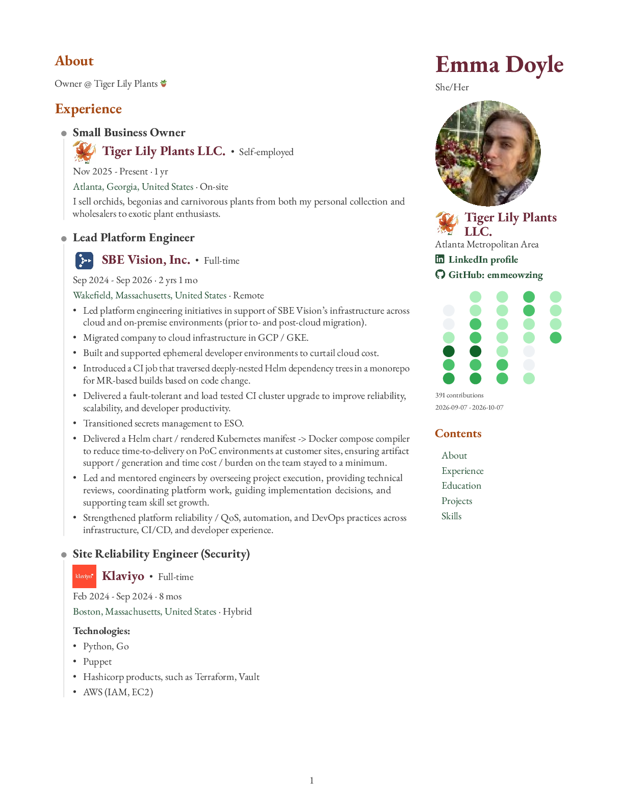

> **Fork example:** This is the README your fork gets after its first successful publication to `main`.
> This example uses the project owner's current profile and PDF. Your fork uses your captured name,
> profile links, configured introduction, and generated PDF; release links point to your repository.
> Signed artifacts appear when you tag a release. [Set up your fork](README.md#quick-start).

---

<!-- Generated by resumeme. Edit readme in resumeme.config.yaml; mode: project preserves a custom README. -->

# Emma Doyle - Résumé

My résumé, kept current from LinkedIn and published here as a PDF\. Open the full document for every page and clickable links\.

**[View résumé (PDF - 4 pages)](./resume.pdf)** - [LinkedIn](https://www.linkedin.com/in/emmeowzing/) - [GitHub](https://github.com/emmeowzing) - [Releases & signatures](https://github.com/astrivant/resume/releases)

*Preview of page 1. Click to open the complete PDF.*

Built with [resumeme](https://github.com/astrivant/resume). [Configuration](resumeme.config.yaml) - [Automation](docs/automation.md).
