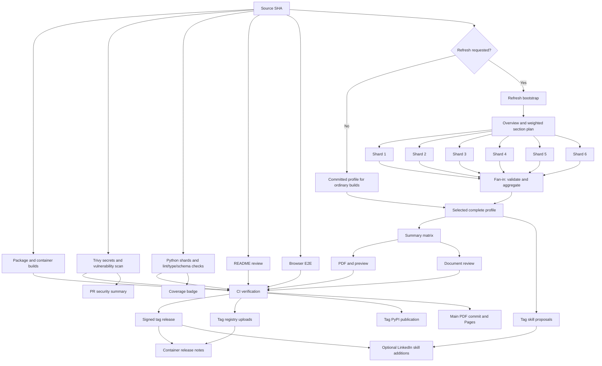

# Monthly refresh and signed releases

The pipeline refreshes LinkedIn on the first day of every month at **06:17 UTC**
(`17 6 1 * *`). It authenticates with the configured browser, captures the profile
overview and route plan, and collects assigned sections using six parallel workers.
The aggregator verifies complete section ownership before images and project
previews are downloaded, validation and PDF generation run, and the complete
snapshot, referenced assets, and PDF are committed to `main` together. The
configured profile path is replaced in place; resumeme does not create dated
profile archives. Ordinary branch pushes rebuild the saved inputs. Neither path
creates a release.

Every tag push also performs a headless LinkedIn capture before validation and
compilation. Capture authenticates once with the configured browser, saves an
encrypted browser session, and builds a weighted plan of profile sections. Six
parallel workers restore independent copies of that browser-specific session and
collect assigned sections without login credentials or shared-cache writes. The
aggregator rejects missing, duplicate, misrouted, or cross-browser shard results
before accepting a complete snapshot. The release signs the fresh PDF built in
that same workflow run, not the PDF committed at the tag. After release
verification, the publication stage restores that run's fresh capture artifact,
then commits its snapshot, referenced media, and signed PDF to the latest `main`
tree. It preserves newer source files and replaces only generated publication
outputs. Pages deploys the accepted commit, including the signed PDF.

Enable `publishing.pages.enabled` to also update a [GitHub Pages website](pages.md) after
that commit is accepted. The optional stage serves `index.html` and the same PDF
at the configured site path, including custom domains.

Forks publish a [personal README and PDF preview](#personal-readme) in that same
commit. Repositories retaining the project README also give the [project logo](https://raw.githubusercontent.com/astrivant/resumeme/main/docs/assets/branding/resumeme-logo.png)
a fresh coffee stain. CI varies its orientation, proportions, placement, and
density using the verified source commit as a seed. Retries reproduce the same
logo; unchanged PDFs and profile inputs produce no extra commit. This uses the
bundled image layers and Pillow, with no image-generation API calls or secrets.
The linked **Brew date** badge beside the project badges shows the published PDF build's UTC
date and opens the configured résumé PDF. Build artifacts carry the date so
deployment retries preserve it. Only the marked logo and date-badge regions are updated in
project READMEs; surrounding documentation is retained.
The logo is README branding; it does not add stains to the résumé PDF.

Before enabling refreshes, review [sensitive data handling](data-handling.md).
The full capture can contain contact fields and sections excluded from the PDF.
It crosses jobs as an ordinary artifact retained for one day and is committed
at the configured snapshot path on a successful refresh. Git history follows
the repository owner's normal retention policy.
Encrypted session reuse protects the browser archive, not those publications.

OpenSSF Scorecard runs as a reusable stage within the same pipeline on default-branch
pushes and scheduled runs. Its public results continue to update the README badge;
forks skip this stage. The weekly Monday **06:43 UTC** schedule (`43 6 * * 1`)
runs only Scorecard, without capture, AI summaries, or resume builds. The monthly
schedule runs both the resume pipeline and Scorecard. Scorecard publication is
independent of the required resume verification check.

The stage keeps its own workflow definition because the
[Scorecard publishing API validates the producing workflow](https://github.com/ossf/scorecard-infra/blob/main/api/app/server/post_results.go)
and [restricts its permissions and steps](https://github.com/ossf/scorecard-action#workflow-restrictions).
It has only a `workflow_call` trigger, so it creates no separate push-triggered run.

## Pipeline concurrency

Jobs depend on actual input artifacts or required verification results. The graph
follows Amdahl's law: shorten the serial path and start independent work early,
including inside reusable workflows. Once the source SHA is resolved, Python test
shards, lint/type/schema checks, Trivy, README review, browser E2E, and package and
container builds all become eligible alongside any required LinkedIn capture.
Runner availability determines when eligible jobs actually start.

Capture is a fan-out/fan-in subgraph: bootstrap creates a weighted plan, six
independent browser jobs collect sections, and aggregation joins their outputs
only after every shard succeeds and matches the plan. Aggregation validates the
fresh snapshot and schema contracts before exporting the accepted profile.
Source checks validate committed inputs and do not download that capture.
Summary generation and tag-only skill proposals start from the accepted profile.
PDF compilation and generated-document review run independently after summaries
finish. Summary matrix jobs retain their four-worker limit;
pytest partitions the collected cases across three `ubuntu-24.04` runners with
four workers each. Lint, type, and schema checks run once in parallel with those
partitions. A failed partition does not cancel the others, and all partitions
must succeed before their coverage is combined into the badge report. The
required verification check still waits for the entire test stage.

Trivy comments wait only for the security stage, so a slow test shard cannot delay
security feedback. Coverage follows the test stage independently of security and
PDF builds. The shared `CI verification` gate still requires every validation
branch before publication; capture failures cannot fall back to old data.
Dependency edges use GitHub's [`needs` semantics](https://docs.github.com/en/actions/reference/workflows-and-actions/workflow-syntax#jobsjob_idneeds).

### LinkedIn capture sharding algorithm

The plan contains the overview snapshot and the owner-scoped detail routes found
on the profile. Each route receives a deterministic weight. If an overview
preview exists, the weight is `max(1, 2 * entry_count + text_characters // 500 + 1)`,
where `text_characters` is the combined length of entry titles and paragraphs.
Without a preview, the fallback is `max(1, title_length // 80 + 1)`. The contact
route has weight `1`. These are estimates of work from profile size, not measured
browser durations.

The planner sorts routes by descending weight, then by route key for a stable
tie-break. For each route, it chooses the shard with the lowest accumulated
weight; equal shard loads go to the lower shard number. Once assignment is done,
each shard's routes are put back in their original profile order. The worker
count is fixed at six, so profiles with fewer routes can have empty shards.

Fan-in requires one result from each of the six shards, including empty ones.
It verifies each result's capture ID, browser, shard index and count, then checks
that its route keys exactly match the planner's assignment. Missing, duplicate,
unexpected, or misrouted results fail aggregation without replacing the accepted
profile. The complete overview is retained, and each collected detail section
replaces only its matching overview preview.



This is the same pipeline shape used by [Polyad's CI workflow](https://github.com/astrivant/polyad/blob/main/.github/workflows/ci.yml):
resolve one source revision, fan out independent work, and fan in at the required
verification point. In resumeme, the six section workers form the fan-out and the
strict profile aggregator is their fan-in. GitHub Actions artifacts carry the
plan and results between jobs; every job checks out the same resolved source SHA.

`CI verification` requires successful source resolution, summaries, Trivy, Python,
lint/type/schema checks, README review, browser E2E, document review, source builds,
and PDF compilation. Requested captures must also
succeed. Skips or failures in required work block publication. Registry uploads
can complete even if PDF signing later fails; release notes wait for both the
signed release and successful registry references. Coverage and Scorecard remain
independent reporting jobs. Live LinkedIn updates retain the shared account-write
lock, and Pages consumes the accepted main publication commit.

## Trivy security scan

The independent security stage scans each source checkout for dependency vulnerabilities and
secret findings with [`aquasec/trivy:0.75.0`](https://hub.docker.com/r/aquasec/trivy),
selected in [`stage-security.yml`](../.github/workflows/stage-security.yml).
The scanner's version-tag pin and the other non-Poetry tool pins are listed in
the [development pin inventory](development.md#pinned-toolchain-and-ci-dependencies).
Any finding, scanner failure, or unreadable report fails the security stage and
blocks `CI verification` on pull requests and pushes. The scan runs alongside
linting and the sharded Python tests.

The report artifact keeps full finding metadata while redacting matched secret
text and removing source snippets. A trusted follow-up job in the same pipeline posts or updates
a concise pull request comment with finding counts, a link to the complete
sanitized artifact, and workflow logs. The scanner job has read-only repository
permissions; only the separate comment job receives permission to write PR
comments.

## Configure a fork

Copy [.config/resumeme.config.ref.yaml](../.config/resumeme.config.ref.yaml) to `resumeme.config.yaml`,
set `profile.linkedin.username`, and capture your own profile before publishing. The
reference keeps optional integrations disabled and uses `publishing.readme.mode: auto` with
`publishing.readme.output: README.md`; it contains no personal exclusions or date window.

Enable Actions, keep `main` as the default branch, and permit the workflow bot to
push generated updates through your branch rules. Set the login secrets using
the GitHub CLI's interactive prompts:

```bash
gh secret set LINKEDIN_USERNAME
gh secret set LINKEDIN_PASSWORD
```

- `LINKEDIN_USERNAME`: accepts a login email/phone, public username, or LinkedIn
  `/in/` profile URL. URLs are normalized to usernames and public identifiers must
  match the configured owner. Use an email/phone for headless CI; public usernames
  and URLs use manual sign-in during interactive capture. No additional login
  variable is needed. Headless use of a public identifier fails before opening a browser.
- `LINKEDIN_PASSWORD`: account password, passed only to capture or explicitly enabled
  ownership/skill updates or saved resume uploads. A login identifier and password are required for tag, monthly, and
  requested manual captures.
- `OPENAI_API_KEY`: needed if `automation.codex.enabled` or `automation.codex.skills.enabled` is true.
  Create it on the [OpenAI API keys page](https://platform.openai.com/api-keys) and save it as an Actions secret.
  The first enables main-branch and tag summaries; the second enables tag-only skill proposals.
- `COSIGN_PRIVATE_KEY` and optional `COSIGN_PASSWORD`: needed when publishing a
  signed tag release, not for monthly refreshes. The private-key secret contains
  the entire Cosign PEM, including its header, footer, and newlines; the password
  is required only for encrypted keys.
- `RESUMEME_CACHE_PRIVATE_KEY`, `RESUMEME_CACHE_PUBLIC_KEY`, and `RESUMEME_CACHE_KEY_PASSWORD`:
  required for tag and scheduled/manual-refresh captures, which fan out to six
  browser workers. The [setup script](linkedin-session-cache.md#setup) generates
  the dedicated PEM pair and uploads all three secrets. Firefox and Chrome use
  distinct encrypted cache namespaces. Local interactive capture does not need
  these secrets.
- `GH_TOKEN` / `GITHUB_TOKEN`: supplied by Actions; no personal access token is
  needed for unprotected branches. The workflow uses `contents: write` for generated
  commits and releases,
  and `packages: write` for the container. The optional Pages deployment uses
  `pages: write`, `id-token: write`, `actions: read`, and `contents: read`.
  Repository rules must permit those writes.
- `RESUME_PUBLISH_TOKEN`: required for direct PDF commits when branch protection
  requires reviews or status checks. Use a repository-scoped contents-write token
  owned by an administrator or another actor permitted to bypass both rules.
  It is used only by the verified main publication job; unprotected forks can omit
  it. Only `astrivant/resumeme` falls back to the organization's existing
  `BENCHMARK_PUBLISH_TOKEN` when this dedicated secret is absent. That token must
  allow contents writes to this repository and bypass its reviews and checks.
  See [repository settings](development.md#repository-settings-and-reviews)
  before enabling the protection declared in `.github/settings.yml`.
- `PYPI_API_TOKEN`: package maintainers only. Version-tag releases map the organization,
  repository, or `pypi` environment secret to `POETRY_PYPI_TOKEN_PYPI`. Resume-only
  forks do not need it; see [package publication](development.md#publish-to-pypi).
- `DOCKER_HUB_TOKEN_EMMEOWZING`: upstream maintainers only. Grant `astrivant/resumeme`
  access to this organization Actions secret for tag-only pushes to
  `emmeowzing/resumeme`. Forks skip this job; see [container publication](containers.md#publish-on-a-tag).

`profile.linkedin.username` accepts a public username or a profile URL such as
`https://www.linkedin.com/in/your-name/`. URLs are normalized to the username,
discarding tracking parameters and fragments. Configuration remains authoritative
for profile selection; login secrets do not silently switch the captured owner.
Public profile identifiers cannot reveal the account's private login email.

The runner uses headless Firefox or Chrome, selected by `capture.browser` with
Firefox as the default. The capture step sets `RESUMEME_LOG_LEVEL=DEBUG` and
`PYTHONUNBUFFERED=1` so browser progress and sanitized request diagnostics stream
to the Actions log. See [logging](CLI.md#logging) for the output format and redaction limits.
The bootstrap job alone receives LinkedIn login secrets and writes the selected
browser's encrypted cache. Each of the six workers restores that cache read-only;
all six can run concurrently without racing cache updates. The session wrapper
places browser state and raw browser diagnostics in a temporary directory. The
capture plan and shard results are short-lived workflow artifacts, while the
accepted snapshot and referenced media are shared with downstream jobs. These
profile-data artifacts are not encrypted by the session-cache key. See the
[artifact inventory and retention periods](data-handling.md#ci-artifacts-commits-and-public-output)
and [cleanup limits](data-handling.md#encrypted-browser-sessions-in-ci).

Every LinkedIn browser command in CI gets up to four complete attempts, with a
fresh temporary browser session for each retry. This covers capture planning,
all six section workers, and the enabled About, skills, and resume publishers.
Each command also retains its operation-level retries. HTTP responses surfaced
to Requests honor a 429 response's `Retry-After` value, capped by
`capture.retry_max_backoff_seconds`. Selenium failures use the configured
exponential delay because WebDriver does not expose LinkedIn response headers
consistently. Network timeouts, connection resets, retryable HTTP statuses, and
recoverable browser errors restart the command. MFA, CAPTCHA, rejected sign-in,
owner mismatches, invalid configuration, and permanent HTTP errors stop without
retry. Publishers reread LinkedIn state before replaying writes. If a resume
upload was submitted but its saved state remains uncertain after bounded checks,
the command stops without another upload; check LinkedIn before manually rerunning it.

## Personal README

See [the fork example](FORK_EXAMPLE.md) for the generated landing page using this project's current profile and PDF.

With the default destination, a fork's first successful publication to `main` replaces
the inherited logo and project instructions with the owner's name, a short introduction, a first-page
image linked to the complete PDF, and LinkedIn, optional GitHub, and release links.
The preview is committed at `docs/assets/resume-preview.png`. The PDF link follows
`document.output.pdf`; release links always target the publishing repository. The page count
comes from the actual PDF, and the name comes from the matching captured profile.
Hidden headline and contact fields are not copied into the introduction.

```yaml
publishing:
  readme:
    mode: auto
    output: README.md
    introduction: null
```

| Setting | Behavior |
| --- | --- |
| `publishing.readme.mode: auto` | Default: generate on repositories GitHub identifies as forks; preserve the upstream project README |
| `publishing.readme.mode: resume` | Generate a personal page even in a standalone repository |
| `publishing.readme.mode: project` | Preserve the existing README, including manual customizations |
| `publishing.readme.output: README.md` | Default destination; replace the repository landing page |
| `publishing.readme.output: docs/FORK_EXAMPLE.md` | Publish the same page separately and retain the project README and its coffee branding |
| `publishing.readme.introduction: null` | Use the shared résumé introduction |
| `publishing.readme.introduction: "Platform engineer building reliable developer infrastructure."` | Replace the introduction with plain text; Markdown and HTML are escaped |

This repository sets `publishing.readme.mode: resume` and `publishing.readme.output: docs/FORK_EXAMPLE.md` to exercise the
publication flow and keep a current example for adopters. Every successful PDF
publication to `main` regenerates the example and first-page preview, committing
them alongside the PDF. Copying the reference
configuration selects `publishing.readme.output: README.md` for your landing page. Forks retaining
the author's config can set that field directly. `publishing.readme.mode: auto` restricts generation
to forks; `publishing.readme.mode: resume` also generates in
standalone repositories. Nested paths such as `docs/examples/resume.md` are
supported, with PDF, configuration, and documentation links relative to
the destination. Images use absolute `raw.githubusercontent.com` URLs targeting
the publishing repository's `main` branch, so they also render outside GitHub.
Paths must stay inside the repository and must not overwrite
configured inputs or other outputs.

Names, profile links, and PDF paths are parameterized automatically. After changing
owners, capture the new owner's profile before pushing; a username mismatch fails
the build. A profile with only a name is sufficient. Set `profile.github.username` to your
own account or `null` to omit that link.

Every PDF publication refreshes the README and preview together, including monthly
captures and ordinary pushes. CI renders page one with Ghostscript from the pinned
TeX image, then passes it with the PDF to deploy. No extra credentials or host
packages are needed. The preview retains the PDF's paper proportions and colors.
Retries produce identical output, and unchanged artifacts do not create extra commits.
Preview failures block publication; stale runs cannot overwrite newer `main` commits.

Edits to the configured output are overwritten on the next publication. Set `publishing.readme.mode: project`
before maintaining your own page; the current README and preview remain in place.
Tag releases, pull requests, and non-main branches never replace the tracked README.
Configuration and operation instructions remain available in [the documentation](README.md),
including [installation](README.md#install) and the [agent workflow](../SKILL.md).

## Run or adjust the schedule

Edit the monthly entry under `on.schedule` in `.github/workflows/ci.yml` to change
the resume refresh cadence. If changing the weekly Scorecard cron, also update
the matching `source` and `verified` job guards in that file. To run a resume
refresh now, select **Run workflow -> main -> refresh**, or run:

```bash
gh workflow run ci.yml --ref main -f refresh=true
```

Manual runs without `refresh=true` use committed inputs. Manual refreshes on another
branch or tag are rejected; tag pushes refresh automatically. Capture, validation,
or compilation failures leave `main` unchanged and block new release publication;
there is no fallback to an older capture reported as a successful refresh. If
`main` advances during verification, publication skips the stale update. Retry
the refresh on the new head when needed.

GitHub schedules run only from the default branch, can be delayed, and may be
disabled after 60 days without repository activity in public repositories.
Check the Actions tab if an expected refresh is missing. See
[GitHub's schedule behavior](https://docs.github.com/en/actions/reference/workflows-and-actions/events-that-trigger-workflows#schedule).

## Authentication recovery

LinkedIn can require MFA, a CAPTCHA, or another account challenge, particularly
from a hosted runner. Waiting for a usable login form uses
`capture.page_timeout_seconds` and the configured exponential retry policy.
Capture supports both LinkedIn's fixed-ID login form and generated-ID layouts
using autocomplete attributes and a regular Sign in button. It selects visible
controls and waits for the submit button to enable after filling the fields.
Autocomplete matching accepts token lists such as `username webauthn`, including
when LinkedIn enables passkey support while the form is being filled.
Credentials are submitted once. If that click times out during navigation, the
client checks the existing session for login completion without submitting again.
Unattended authentication then waits for the page timeout and reports the failed
stage and a sanitized page category, such as `login` or `checkpoint`.

Origin checks accept HTTPS `linkedin.com` and its subdomains on the default port
or port `443`, including regional redirects. Other hosts, HTTP, URL userinfo,
and nonstandard ports stop automatic sign-in. The error reports only the scheme,
hostname, and port, omitting URL paths, credentials, queries, and fragments.
Empty locations and `about:blank` wait within the current stage's existing
deadline and retry limits; they never receive credentials. Browser-owned network
or certificate error pages report a navigation failure instead of a login error.
A blank document during app approval does not reset its deadline. These errors
do not establish that the login secrets are wrong.

When LinkedIn displays its [app sign-in approval prompt](https://www.linkedin.com/help/linkedin/answer/a1426391),
the command prints a notice to open the LinkedIn app and tap **Yes, it's me**.
`capture.app_approval_timeout_seconds` defaults to `900` (15 minutes), accepts
`0` to disable waiting, and is capped at `900`. The same browser session remains
open, and capture resumes once LinkedIn redirects it to an authenticated page.
The wait has one deadline and does not resubmit credentials or resend notifications.
Unrecognized or temporarily unreadable checkpoints receive the same bounded window.

LinkedIn controls the wording and device or browser label shown in its app
notification. Resumeme cannot set that label or attach a custom reason to the
request. Before waiting, the command prints a sign-in audit record with the
configured public profile slug, selected browser, workflow and job IDs, trigger,
repository ref, source commit, run ID and attempt, UTC request time, checkpoint category,
timeout, and a direct Actions run link. The record is also appended to the job's
Actions summary. The stdout record is available while the request is pending;
GitHub renders the summary after the step finishes. Approve only when the run
matches a tag, manual dispatch, or scheduled refresh you expected. The record
does not verify what LinkedIn displayed on the phone.

Code-entry MFA, CAPTCHA, and denied or expired approvals fail as soon as they are
detected, including during the approval wait. Timeout errors identify the last
classification, a fixed detector name, whether the page was readable, and counts
of visible inputs and frames. Diagnostics contain no page text, field values,
account identifiers, cookies, or URL tokens. Detection uses visible controls and
English prompt text, matching the browser's configured language. These errors
do not indicate missing login secrets. Signing in in a separate local browser does
not authenticate the CI runner; approving that runner's request in the app does.
Local capture keeps its unlimited interactive wait:

```bash
poetry run resumeme capture
poetry run resumeme validate
poetry run resumeme render
```

Complete any challenge in the selected browser, render the saved profile locally,
then commit the accepted snapshot and assets and push them to `main`. `render`
applies the same post-Jinja TeX cleanup used by the automated PDF build. Correct
login secrets only when a credential error identifies them as the problem.
Accounts that consistently require interaction can use this local capture path
for ordinary branch builds. Tag releases now require a successful headless
capture; committing a local snapshot does not bypass that requirement.
Unattended authentication is not guaranteed from a hosted runner.

For session reuse, configure the [encrypted browser cache](linkedin-session-cache.md).
Only ciphertext is saved to Actions cache or optional persistent runner storage.
The capture job can use a dedicated runner without moving tests, model calls,
PDF builds, or pull-request checks off GitHub-hosted machines.

For a failed About, skills, or saved resume publication, run the corresponding
`publish-ownership`, `publish-skills`, or `publish-resume` command locally without
`--headless`; committing a captured snapshot does not apply those account updates.
For a resume upload, use the verified signed release PDF. See [CLI commands](CLI.md).

## Choose a version to share

Commit and push the configuration you want to use, then tag that revision. Its
pipeline captures your current LinkedIn profile and builds a new PDF. Use a résumé tag
such as `resume-2026-10` to avoid triggering the separate `v<version>` PyPI release:

```bash
git switch main
git pull --ff-only
git tag resume-2026-10
git push origin resume-2026-10
```

The source stage exports one complete `resumeme-profile` capture for this run.
Validation, enabled summaries, compilation, and optional skill proposals use that
same capture. After verification, the release job downloads **this run's
`resume-pdf` artifact** and adds a light-gray footer on its last page with the exact
release link and signing key fingerprint. It preserves the freshly compiled body
and generated summaries, then signs the PDF including that footer. It releases
the PDF, Cosign signature bundles, public key, SHA-256 manifest, key fingerprint,
and source revision. After release publication, a tag stage commits those same
verified files and the matching captured profile and media to `main`, but only
when `main` still points at the tagged source and the tag is still the latest
release. The commit also refreshes the configured README preview or project
branding. The Pages stage then publishes that accepted commit. The container
stage appends its pull instructions to the same release. See
[signature verification](README.md#signed-releases).

When `automation.codex.skills.enabled` is true, a separate stage generates an evidence-backed
`resumeme-skills` artifact. Set `automation.codex.skills.publish: true` to add missing skills
to LinkedIn after publication. All existing skills and endorsements are retained;
see [skill proposals and publication](skills.md).

Missing credentials, an authentication challenge, an incomplete capture, or a
missing build artifact fails the pipeline instead of publishing an older PDF.
The capture artifact is retained for seven days and the PDF build artifact for
fourteen days. `source.json` identifies the tagged code revision; the live capture
is an input artifact from the run, not a change to that Git commit.

If `main` has advanced or a newer release exists, the tag remains available on
GitHub but its older PDF is not copied over current files. A successful tag
publication adds `resume.pdf`, its detached signature and Cosign bundles,
`cosign.pub`, the fingerprint, provenance, and both checksum files to `main`.
The next unsigned branch build removes those sidecars when it replaces the
signed PDF, so the repository never leaves a stale signature beside new bytes.
If `linkedin.ownership.update_about` is enabled, a separate job signs in after
publication to maintain the public signing fingerprint and releases link in
About. See [configuration, previews, and recovery](ownership.md).

Set `linkedin.resume.publish: true` to upload the same verified `signed-resume`
artifact to LinkedIn's saved application resumes in another job. This opt-in
defaults to false and uses the existing LinkedIn secrets. An optional
`linkedin.resume.replace_existing` setting controls retention: `true` deletes
all other saved resumes only after the new PDF is confirmed on LinkedIn;
`false` keeps them and is the package and reference-config default. This
replacement option is true in this repository's personal config. An optional
`linkedin.resume.share_with_recruiters` override enables (`true`) or disables
(`false`) recruiter sharing after upload; `null` preserves the account setting.
The job checks that its tag is GitHub's latest release before
uploading; an older tag's retry is skipped. See [application resume uploads](linkedin-resume.md).

Public release PDFs are never replaced on retries. Rerunning failed downstream
jobs can reuse the completed capture and build from that run; rerunning all jobs
captures again and can produce a different PDF that cannot replace an already
public release. Use a new tag for updated content or pipeline fixes. Rerunning an
old tag does not pick up workflow changes committed later on `main`. Share the
release's PDF and verification files with the intended recipient.
