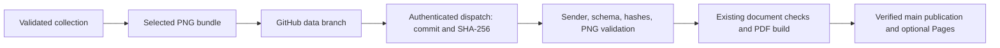

# Awareness figures

[Witful](https://github.com/astrivant/identity) is the identity project's evidence
and awareness tool. It can publish selected evidence plots to a resumeme repository and request
a rebuild through GitHub's authenticated `repository_dispatch` API. Each figure
is independently disabled by default. This integration uses the existing CI
pipeline and publication checks, including the configured Pages deployment.

These optional appendices provide a professional signature of your work: the
problems you solve, skills and tools you apply, and recorded decisions that explain
your approach. They make patterns of experience visible and support reflection as
you work with an agent. Select figures that help the reader understand that work;
the resume remains complete without them. This visual signature is separate from
the release's cryptographic signature.

## Configure the receiver

Commit these settings to the resume repository's `main` branch, together with
the awareness-capable workflow:

```yaml
automation:
  awareness:
    enabled: true
    # GitHub account logins authorized to send awareness updates.
    allowed_actors: [your-github-login]

document:
  appendices:
    awareness:
      figures:
        knowledge-usage: true
        knowledge-map: false
        decision-influences: false
        knowledge-hierarchy: false
        toolbox-use: true
        problem-repertoire: false
        checkpoint-transitions: false
        checkpoint-comparisons: false
      include: []
      exclude: []
```

`your-github-login` means the **GitHub account username authenticated by the sender's
credentials**. For example, if `octocat` uses their personal access token to update
`example-org/resume`, set `allowed_actors: [octocat]`, even though an organization
owns the destination. Use the bare username, without `@`, a profile URL, or an email
address. This is separate from the LinkedIn username and is not inferred from
other profile settings.

For local GitHub CLI authentication or a personal access token, check the account
using the same environment that will run `witful awareness push`:

```bash
gh api --hostname github.com user --jq .login
```

Copy that output into `allowed_actors`. For a GitHub App installation token, use
the App's bot login, such as `example-app[bot]`; the personal-account command above
does not apply. Multiple senders can be listed as `[octocat, 'example-app[bot]']`.

This YAML field is a literal allowlist, not a credential or environment-variable
reference. Resumeme does not expand `$GH_TOKEN` or `${GITHUB_ACTOR}` in it. The
receiver compares the configured logins with GitHub's `GITHUB_ACTOR` and verifies
that the event's `sender.login` matches. GitHub supplies those values; do not set
them yourself. Forks receive no authorization until their owner enables it.

Mapping order controls appendix order. `include: [{group: knowledge}]` narrows
enabled figures to that category; it does not enable disabled switches.
`exclude: [{id: knowledge-map}]` hides that figure even when enabled. Selectors
accept `id`, `group`, or both. Fields within one selector are ANDed; selectors
within each list are ORed. Exclusions win. Company-specific document overrides
can change these selections independently.

| Figure ID | Group | Evidence shown |
| --- | --- | --- |
| `knowledge-usage` | `knowledge` | Recorded concept applications |
| `knowledge-map` | `knowledge` | How my skills connect: relationships and observed reuse |
| `decision-influences` | `life` | What informs my decisions: skills and lessons referenced by current accepted decisions |
| `knowledge-hierarchy` | `knowledge` | Organized disciplines, skills, and lessons |
| `toolbox-use` | `repertoire` | Recorded tool use by task |
| `problem-repertoire` | `repertoire` | Problem taxonomy and observed tasks |
| `checkpoint-transitions` | `checkpoints` | Changes between consecutive project visits |
| `checkpoint-comparisons` | `checkpoints` | Latest state compared with earlier visits |

Counts describe recorded evidence, not proficiency or independently assessed
mastery. Each selected plot receives a full-width appendix page and preserves its
aspect ratio. Contents groups the links under **Appendix**, with consecutive
**Figure 1**, **Figure 2**, and later identifiers. A purpose label of at most two
words sits beside each identifier in Contents at 80% of its text size, vertically
centered and colored with the active theme's section-heading color. For example, the connection map is
**Connected skills**, and the
decision chart is **Engineering judgment**. Hidden figures leave no numbering
gaps; an enabled GitHub contribution appendix is the first figure.
Below each plot, the caption explains what its shapes, connections, or counts
demonstrate and how to interpret the recorded evidence. A small note at the foot
of each awareness page explains that the figures update automatically from
recorded day-to-day work, forming an evolving view of engineering practice.
It links to **Witful** and this update workflow. Each PDF remains a snapshot of
the evidence available at its build; automatic delivery requires the sender
automation and receiver opt-in described below.

Witful generates projections without embedded outer titles or question subtitles.
The resume owns their headings; axis labels, legends, and evidence notes remain
visible. Standalone collection plots retain their titles. Existing bundles must
be regenerated to remove titles already embedded in their PNGs.

The connection map shows up to twelve disciplines, sized and positioned by
recent recorded applications. A weighted two-dimensional Gaussian is fitted to
their layout; its covariance can rotate the ellipse, and opacity fades with
Mahalanobis distance across twice the 1.75 standard-deviation reference distance,
with a readable floor. Gray contours show 0.5, 1, 1.5, and 2 standard deviations;
half steps are dashed and whole steps are solid. A gray, white-outlined plus marks
the fitted mean. Centered labels remain fully opaque and use contrast-aware text
without background boxes. Text placement and line gaps prevent label collisions.
This describes current working emphasis; the full hierarchy, relationship
export, and historical observations remain available in the source collection.
See [the map's evidence and layout contract](https://github.com/astrivant/identity/blob/main/docs/knowledge-map.md).

## Configure and push from Witful

Use a Witful version containing `awareness` and an authenticated GitHub CLI.
Create `knowledge/awareness.json` in your existing collection:

```json
{
  "repository": "your-account/your-resume",
  "figures": ["knowledge-usage", "toolbox-use"]
}
```

An empty `figures` list cannot publish anything. Include every figure enabled by
the receiver and its employer-specific variants. The command regenerates plots
from current validated evidence, rather than copying potentially stale images.

```bash
witful awareness --repo /path/to/collection build
witful awareness --repo /path/to/collection push
```

`build` writes `.witful/awareness.json` locally. Review the selected plot labels
before `push`: those labels become visible in the destination repository and PDF.
For an offline resume build, copy the reviewed bundle to `data/awareness.json`
in the resume checkout, then run `resumeme build` normally.

`gh auth login --hostname github.com` provides local authentication. Automation
can use `GH_TOKEN` with a fine-grained personal access token or GitHub App
installation token granting **Contents: write** to the destination repository.
`GH_TOKEN` overrides credentials stored by `gh auth login`, so the allowlist must
match the account represented by that token. See [GitHub CLI environment variables](https://cli.github.com/manual/gh_help_environment).

For example, store `octocat`'s token as an Actions secret named
`AWARENESS_GITHUB_TOKEN` in the **sending** repository, then use this step after
checking out the collection and installing Witful:

```yaml
- name: Publish awareness figures
  env:
    GH_TOKEN: ${{ secrets.AWARENESS_GITHUB_TOKEN }}
  run: witful awareness --repo . push
```

The receiver's config still contains `allowed_actors: [octocat]`. The secret name
is your choice; its value is the token, not the username. In this example the
destination sees `octocat` as the sender, regardless of who triggered the sending
workflow. An App installation token instead requires its bot login in the allowlist.

The ordinary cross-repository `GITHUB_TOKEN` does not automatically grant this
access. No extra webhook secret or public listener is required. GitHub Enterprise
hosts are not supported by this initial adapter.

## Delivery and verification



The sender maintains `awareness.json` on the reserved `witful-awareness` branch
in the **destination** repository. Its push is excluded from normal CI triggers;
one `witful-awareness` dispatch starts the main pipeline. Identical bundles reuse
the existing Git blob and commit. A retry can create another dispatch, but it does
not create another identical data commit.

The payload contains only version, full Git commit, and SHA-256. The receiver
downloads a fixed path from its own repository at that immutable commit. It runs
default-branch code, never scripts or workflows from the incoming data commit.
GitHub authentication and the actor allowlist establish authorization; SHA-256
checks integrity, not signer identity. No Cosign signature is implied by a push.

Both document consumers receive the same validated artifact. The accepted bundle
is committed as `data/awareness.json` with its generated PDF, so subsequent builds
and releases preserve the figures without contacting the collection. Existing
branch-advancement checks prevent stale builds from overwriting newer `main`.
An awareness rebuild reuses the current saved LinkedIn profile; it does not sign
in to LinkedIn. Tag builds retain the existing live-capture and signing behavior.

The sender reports **dispatch accepted**, not build completed. Follow the Actions
URL it prints. If delivery fails, retry `push`; if validation fails, correct the
receiver settings or bundle selection first. Required missing figures fail the
build instead of silently omitting them. Enable switches do not download or
publish data by themselves.

## Data boundaries

Only selected PNGs, public captions, catalog IDs, and hashes travel in the bundle.
Witful scans the rendered SVG text for its supported personal-data patterns before
exporting PNGs, but that is not comprehensive anonymization or OCR. Plot labels
can reveal project names, skills, tools, or relationships. Review them before
publication; private collection material must remain in the source collection.

Bundles are limited to 8 MiB, individual PNGs to 2 MiB and 16 million pixels, and
images to one frame. Unknown versions, fields, groups, duplicate IDs, invalid
images, and mismatched hashes fail validation. Compiler assets are decoded and
re-encoded without PNG metadata. Source journal text, database files, credentials,
local checkout paths, and executable input files are not exported.

The data branch and accepted main bundles remain in Git history; disabling a
figure hides it from future PDFs but does not erase earlier commits or releases.
The transient CI input artifact expires after one day; ordinary PDF artifacts
retain the existing 14-day policy. See [sensitive data handling](data-handling.md).

Contract references: [GitHub dispatch API](https://docs.github.com/en/rest/repos/repos#create-a-repository-dispatch-event),
[Witful](https://github.com/astrivant/identity), and the packaged
[bundle schema](../pkg/resumeme/compiler/asts/resources/awareness.schema.json).
