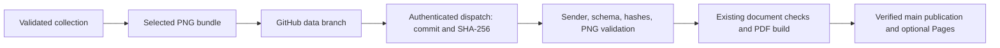

# Awareness figures

Witful can publish selected evidence plots to a resumeme repository and request
a rebuild through GitHub's authenticated `repository_dispatch` API. Each figure
is independently disabled by default. This integration uses the existing CI
pipeline and publication checks, including the configured Pages deployment.

## Configure the receiver

Commit these settings to the resume repository's `main` branch, together with
the awareness-capable workflow:

```yaml
automation:
  awareness:
    enabled: true
    allowed_actors: [your-github-login]

document:
  appendices:
    awareness:
      figures:
        knowledge-usage: true
        knowledge-map: false
        knowledge-hierarchy: false
        toolbox-use: true
        problem-repertoire: false
        checkpoint-transitions: false
        checkpoint-comparisons: false
      include: []
      exclude: []
```

Use the GitHub login that authenticates the dispatch, or the exact App bot login
such as `example-app[bot]`. A public profile username is not inferred from any
other configuration. Forks receive no authorization until their owner enables it.

Mapping order controls appendix order. `include: [{group: knowledge}]` narrows
enabled figures to that category; it does not enable disabled switches.
`exclude: [{id: knowledge-map}]` hides that figure even when enabled. Selectors
accept `id`, `group`, or both. Fields within one selector are ANDed; selectors
within each list are ORed. Exclusions win. Company-specific document overrides
can change these selections independently.

| Figure ID | Group | Evidence shown |
| --- | --- | --- |
| `knowledge-usage` | `knowledge` | Recorded concept applications |
| `knowledge-map` | `knowledge` | Concept relationships and observed reuse |
| `knowledge-hierarchy` | `knowledge` | Organized disciplines, skills, and lessons |
| `toolbox-use` | `repertoire` | Recorded tool use by task |
| `problem-repertoire` | `repertoire` | Problem taxonomy and observed tasks |
| `checkpoint-transitions` | `checkpoints` | Changes between consecutive project visits |
| `checkpoint-comparisons` | `checkpoints` | Latest state compared with earlier visits |

Counts describe recorded evidence, not proficiency or independently assessed
mastery. Each selected plot receives a full-width appendix page, preserves its
aspect ratio, and is linked from the first-page Contents.

## Configure and push from Witful

Use a Witful version containing `awareness` and an authenticated GitHub CLI.
Create `knowledge/awareness.json` in your existing collection:

```json
{
  "repository": "your-account/your-resume",
  "figures": ["knowledge-usage", "toolbox-use"]
}
```

An empty `figures` list cannot publish anything. Include every figure enabled by
the receiver and its employer-specific variants. The command regenerates plots
from current validated evidence, rather than copying potentially stale images.

```bash
witful awareness --repo /path/to/collection build
witful awareness --repo /path/to/collection push
```

`build` writes `.witful/awareness.json` locally. Review the selected plot labels
before `push`: those labels become visible in the destination repository and PDF.
For an offline resume build, copy the reviewed bundle to `data/awareness.json`
in the resume checkout, then run `resumeme build` normally.

`gh auth login --hostname github.com` provides local authentication. Automation
can use `GH_TOKEN` with a fine-grained token or GitHub App token granting
**Contents: write** to the destination repository. The ordinary cross-repository
`GITHUB_TOKEN` does not automatically grant this access. No extra webhook secret
or public listener is required. GitHub Enterprise hosts are not supported by this
initial adapter.

## Delivery and verification



The sender maintains `awareness.json` on the reserved `witful-awareness` branch
in the **destination** repository. Its push is excluded from normal CI triggers;
one `witful-awareness` dispatch starts the main pipeline. Identical bundles reuse
the existing Git blob and commit. A retry can create another dispatch, but it does
not create another identical data commit.

The payload contains only version, full Git commit, and SHA-256. The receiver
downloads a fixed path from its own repository at that immutable commit. It runs
default-branch code, never scripts or workflows from the incoming data commit.
GitHub authentication and the actor allowlist establish authorization; SHA-256
checks integrity, not signer identity. No Cosign signature is implied by a push.

Both document consumers receive the same validated artifact. The accepted bundle
is committed as `data/awareness.json` with its generated PDF, so subsequent builds
and releases preserve the figures without contacting the collection. Existing
branch-advancement checks prevent stale builds from overwriting newer `main`.
An awareness rebuild reuses the current saved LinkedIn profile; it does not sign
in to LinkedIn. Tag builds retain the existing live-capture and signing behavior.

The sender reports **dispatch accepted**, not build completed. Follow the Actions
URL it prints. If delivery fails, retry `push`; if validation fails, correct the
receiver settings or bundle selection first. Required missing figures fail the
build instead of silently omitting them. Enable switches do not download or
publish data by themselves.

## Data boundaries

Only selected PNGs, public captions, catalog IDs, and hashes travel in the bundle.
Witful scans the rendered SVG text for its supported personal-data patterns before
exporting PNGs, but that is not comprehensive anonymization or OCR. Plot labels
can reveal project names, skills, tools, or relationships. Review them before
publication; private collection material must remain in the source collection.

Bundles are limited to 8 MiB, individual PNGs to 2 MiB and 16 million pixels, and
images to one frame. Unknown versions, fields, groups, duplicate IDs, invalid
images, and mismatched hashes fail validation. Compiler assets are decoded and
re-encoded without PNG metadata. Source journal text, database files, credentials,
local checkout paths, and executable input files are not exported.

The data branch and accepted main bundles remain in Git history; disabling a
figure hides it from future PDFs but does not erase earlier commits or releases.
The transient CI input artifact expires after one day; ordinary PDF artifacts
retain the existing 14-day policy. See [sensitive data handling](data-handling.md).

Contract references: [GitHub dispatch API](https://docs.github.com/en/rest/repos/repos#create-a-repository-dispatch-event),
[Witful](https://github.com/astrivant/identity), and the packaged
[bundle schema](../pkg/resumeme/compiler/asts/resources/awareness.schema.json).
